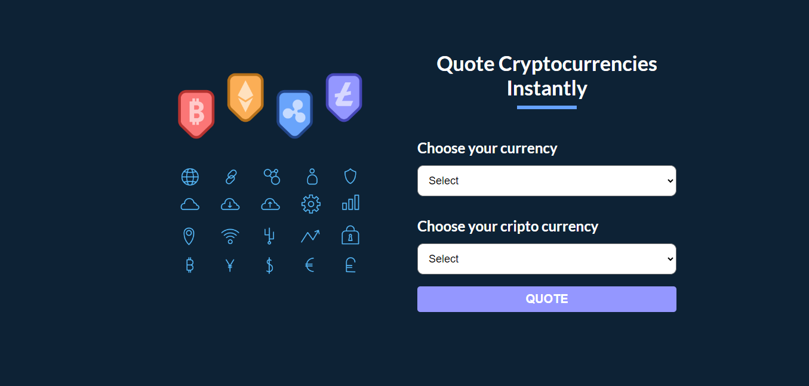
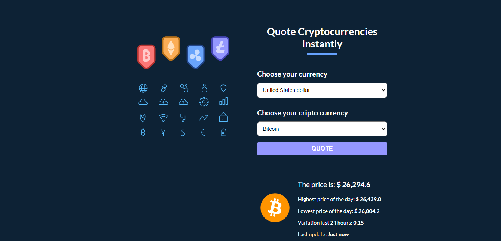

<div align="center">
  
  <h3><b>Cryptocurrency Quoter</b></h3>

  

  

  <br/>

  

</div>

# 📗 Table of Contents <a name="table-of-contents"></a>

- [📗 Table of Contents](#-table-of-contents-)
- [📖 About the Project](#-about-the-project-)
  - [🚀 Live Demo ](#-live-demo-)
  - [🛠 Built With](#-built-with-)
    - [Tech Stack](#tech-stack-)
    - [Key Features](#key-features-)
  - [🚀 Getting Started](#-getting-started-)
    - [Prerequisites](#prerequisites)
    - [Setup](#setup)
    - [Install](#install)
    - [Usage](#usage)
  - [👥 Authors](#-authors-)
  - [🤝 Contributing](#-contributing-)
  - [📝 License](#-license-)

<!-- PROJECT DESCRIPTION -->

# 📖 About the Project <a name="about-project"></a>

**Cryptocurrency Quoter**  This web application, built with React, allows users to instantly quote various cryptocurrencies against different currencies. Users can enter the desired cryptocurrency and currency pair, allowing them to get real-time quotes. The user-friendly interface ensures seamless interaction with cryptocurrency quote data, allowing for easy quote editing.

To access cryptocurrency data, the application uses the API provided by CryptoCompare, which can be found at https://min-api.cryptocompare.com/.

<!-- LIVE DEMO -->

## 🚀 Live Demo <a name="live-demo"></a>

- [Live Demo](https://cilfonegabriel.github.io/cryptocurrency-quoter//)


<p align="right">(<a href="#readme-top">back to top</a>)</p>

## 🛠 Built With <a name="built-with"></a>

### Tech Stack <a name="tech-stack"></a>

<details>
  <summary>Client</summary>
  <ul>
    <li>HTML, CSS, Styled Component, JavaScript</li>
    <li><a href="https://reactjs.org/">React.js</a></li>
  </ul>
</details>

# 🚀 Getting Started <a name="getting-started"></a>

To get a local copy up and running, follow these steps.

### Setup

1. Clone this repository to your desired folder:

```sh
git https://github.com/cilfonegabriel/cryptocurrency-quoter.git
cd cryptocurrency-quoter


### Install

After cloning the repo, navigate into it and install all the required packages with the following command:

```sh

npm install


```

Then just wait for everything to finish downloading.

### Usage

Start the React app:

`npm run dev`

Runs the app in the development mode.\
Open [http://localhost:3000](http://localhost:3000) to view it in your browser.

The page will reload when you make changes.\
You may also see any lint errors in the console.

`npm run eject`


### Deployment

You can deploy this project using:

`npm run build`

Builds the app for production to the `build` folder.\
It correctly bundles React in production mode and optimizes the build for the best performance.

The build is minified and the filenames include the hashes.\
Your app is ready to be deployed!

See the section about [deployment](https://facebook.github.io/create-react-app/docs/deployment) for more information.

<p align="right">(<a href="#readme-top">back to top</a>)</p>

<!-- AUTHORS -->

## 👥 Authors <a name="authors"></a>

👤 **Gabriel -Cilfone**
- GitHub: [Gabriel Cilfone](https://github.com/cilfonegabriel)
- LinkedIn: [Gabriel Cilfone](www.linkedin.com/in/gabriel-cilfone/)

<p align="right">(<a href="#readme-top">back to top</a>)</p>

<!-- FUTURE FEATURES -->

## 🔭 Future Features <a name="future-features"></a>

- [ ] **Complete the about pages**
- [ ] **Add reorder functionality**
- [ ] **Deploy a live demo**
- [ ] **Add account support to store your list**

<p align="right">(<a href="#readme-top">back to top</a>)</p>

<!-- CONTRIBUTING -->

## 🤝 Contributing <a name="contributing"></a>

Contributions, issues, and feature requests are welcome!

Feel free to check the [issues page](https://github.com/cilfonegabriel/cryptocurrency-quoter/issues).

<p align="right">(<a href="#readme-top">back to top</a>)</p>

<!-- SUPPORT -->

<p align="right">(<a href="#readme-top">back to top</a>)</p>

<!-- ACKNOWLEDGEMENTS -->

## 🙏 Acknowledgments <a name="acknowledgements"></a>

- Thanks to Microverse and all my teammates!

<p align="right">(<a href="#readme-top">back to top</a>)</p>

## 📝 License <a name="license"></a>

This project is [MIT](./LICENSE) licensed.

<p align="right">(<a href="#readme-top">back to top</a>)</p>